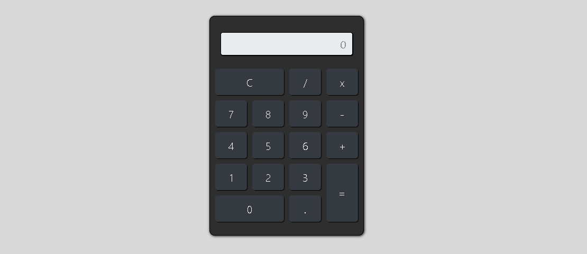

<h1>➕➖ App Calculadora ✖➗</h1>
<h3>Seção 8: JavaScript</h3>

Curso Desenvolvimento Web Completo 2022

## O Projeto:
Criação do App Calculadora, primeiro projeto da Seção de JavaScript do Curso de Desenvolvimento Web 2022.

 

 

## Desenvolvimento:

### Aula 01: Criação da função responsável por receber os valores e as ações que podem ser realizadas.

1. Criação da tag script ao final do body;

2. Criação da função calcular();

3. Definição dos parâmetros em cada um dos eventos onclick (valor, ação).

### Aula 02: Implementando a lógica do cálculo.

1. Desenvolvimento da festrutura condicional if/else dentro da função calcular(), para determinar se e um valor ou ação.

2. Definição da id "resultado" para o campo de saída de valores.

3. 

